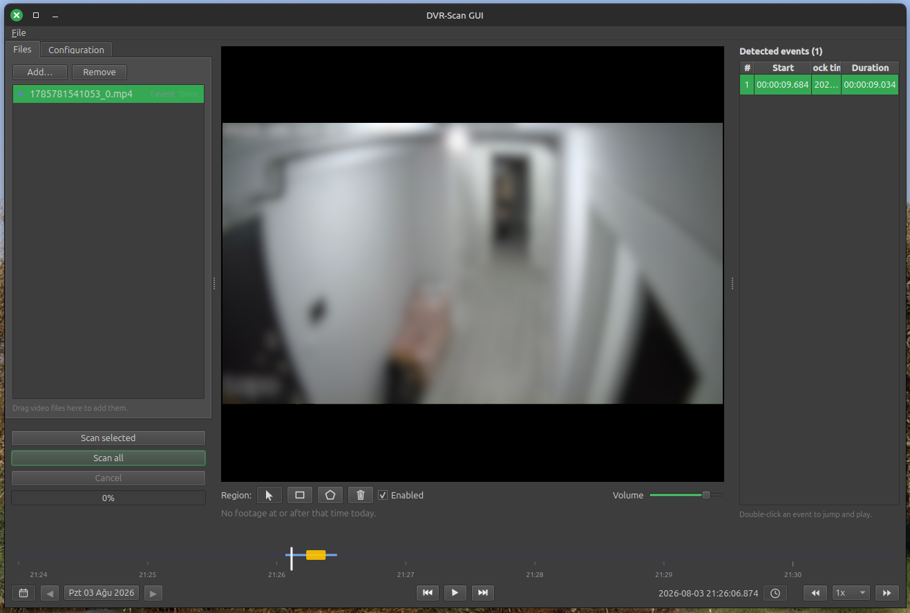

# DVR-Scan GUI

A Qt desktop GUI for [DVR-Scan](https://www.dvr-scan.com/). Configure a motion
scan, run it, then review the results in an integrated video player: detected
motion events are drawn directly on the seek bar and listed in a table you can
click to jump to.

Core functionality is provided by the DVR-Scan utility which does the
actual scanning of the video file for events. You need to install it
before using this GUI. DVR-Scan already has a GUI but it is a bit
basic.

Installing dvr-scan on linux is relatively easy. On windows, this tool
will help you install it.



## Features

- Multiple file support
- Configure scan details
- Display events in a list and quickly jump the them
- Global timeline support with event display and quick navigation
- Basic player controls, speed up, full screen
- Detection regions

## Requirements

- Python 3.12
- [`dvr-scan`](https://pypi.org/project/dvr-scan/) on your `PATH`
  (`pip install dvr-scan`) — **required** for scanning.
- `ffprobe` on your `PATH` (part of [FFmpeg](https://ffmpeg.org/), e.g.
  `sudo apt install ffmpeg`) — *optional*; used to read each recording's start
  time and duration for the clock-time / global-timeline features.
- Playback uses Qt Multimedia. PySide6 6.11 ships a bundled FFmpeg backend, so
  no extra system media packages are normally required.

## Packaged builds

See Github releases.

## Setup

Dependencies are managed with **pipenv**:

```bash
pipenv install
```

## Run

```bash
pipenv run gui
# or
pipenv run python -m dvr_scan_gui
```
